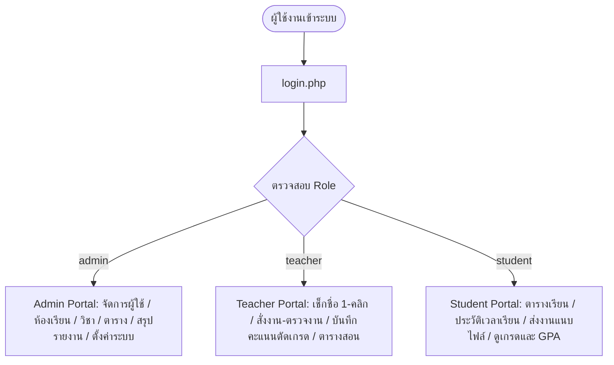

# ระบบบริหารจัดการชั้นเรียน (Classroom Management System)

> **โครงงานพัฒนา Web Application สำหรับสถานศึกษา ระดับประกาศนียบัตรวิชาชีพชั้นสูง (ปวส.) / ปริญญาตรี**  
> พัฒนาด้วย: **PHP 8+ | MySQL (utf8mb4) | PDO | Bootstrap 5.3 | Bootstrap Icons | Chart.js**  
> รองรับการติดตั้งและเปิดใช้งานบน: **XAMPP (Apache + MySQL)** บน Windows / macOS / Linux

---

## 📖 สารบัญ (Table of Contents)
1. [ภาพรวมของระบบ (System Overview)](#1-ภาพรวมของระบบ-system-overview)
2. [สถาปัตยกรรมและเทคโนโลยีที่ใช้ (Tech Stack)](#2-สถาปัตยกรรมและเทคโนโลยีที่ใช้-tech-stack)
3. [โครงสร้างบทบาทและสิทธิ์ผู้ใช้งาน (RBAC)](#3-โครงสร้างบทบาทและสิทธิ์ผู้ใช้งาน-rbac)
4. [บัญชีทดสอบระบบ (Demo Accounts)](#4-บัญชีทดสอบระบบ-demo-accounts)
5. [ขั้นตอนการติดตั้งบน XAMPP แบบละเอียด (Step-by-Step Installation)](#5-ขั้นตอนการติดตั้งบน-xampp-แบบละเอียด-step-by-step-installation)
6. [โครงสร้างฐานข้อมูล (Database Schema)](#6-โครงสร้างฐานข้อมูล-database-schema)
7. [โครงสร้างไฟล์และโฟลเดอร์ (Folder Structure)](#7-โครงสร้างไฟล์และโฟลเดอร์-folder-structure)
8. [จุดเด่นและฟังก์ชันการทำงานหลัก (Key Features)](#8-จุดเด่นและฟังก์ชันการทำงานหลัก-key-features)
9. [ความปลอดภัยของระบบ (Security Standards)](#9-ความปลอดภัยของระบบ-security-standards)

---

## 1. ภาพรวมของระบบ (System Overview)
**ระบบบริหารจัดการชั้นเรียน (Classroom Management System)** ถูกออกแบบและพัฒนาขึ้นเพื่อเป็นศูนย์กลางในการบริหารจัดการข้อมูลการเรียนการสอนสำหรับสถานศึกษา ช่วยลดขั้นตอนความซ้ำซ้อนในการทำงานของครูผู้สอน เพิ่มความโปร่งใสในการวัดและประเมินผล และช่วยให้นักศึกษาสามารถติดตามผลการเรียน การเข้าเรียน การส่งงาน และประกาศข่าวสารได้อย่างสะดวกรวดเร็วผ่านอุปกรณ์ Desktop, Tablet และ Mobile (Responsive Design)

---

## 2. สถาปัตยกรรมและเทคโนโลยีที่ใช้ (Tech Stack)

### Frontend:
- **HTML5 & CSS3**: ออกแบบโครงสร้างตามมาตรฐาน Semantic HTML5
- **Bootstrap 5.3.3**: Responsive UI Framework จัดการ Grid System และ Components
- **Bootstrap Icons 1.11.3**: ไอคอนแบบ SVG คมชัดทุกขนาดหน้าจอ
- **Chart.js**: กราฟิกแสดงสถิติเชิงปริมาณบน Dashboard แบบโต้ตอบได้ (Interactive Visualizations)
- **Google Fonts (Prompt & Sarabun)**: ฟอนต์ภาษาไทยมาตรฐานที่อ่านง่ายและทันสมัย
- **Vanilla JavaScript (ES6+)**: การคำนวณคะแนนและเกรดแบบเรียลไทม์ (Live Calculation), การส่งออกไฟล์ Excel/CSV พร้อมรองรับภาษาไทย (UTF-8 BOM), และการแสดง/ซ่อนรหัสผ่าน

### Backend:
- **PHP 8+**: โครงสร้าง MVC-Friendly แบบ Modular Architecture
- **PDO (PHP Data Objects)**: การเชื่อมต่อฐานข้อมูลที่มีความปลอดภัยสูง พร้อม Prepared Statements
- **Session Authentication & RBAC**: ระบบรักษาความปลอดภัยเซสชัน ป้องกัน Session Fixation
- **CSRF Token Guard**: ตรวจสอบความถูกต้องของ Token ทุก Form Submission

### Database:
- **MySQL 8.0+ / MariaDB**: Storage Engine เป็น `InnoDB` รองรับ Foreign Keys
- **Character Set**: `utf8mb4` / **Collation**: `utf8mb4_unicode_ci` รองรับสระภาษาไทยและ Emoji ครบถ้วน

---

## 3. โครงสร้างบทบาทและสิทธิ์ผู้ใช้งาน (RBAC)

ระบบแบ่งระดับผู้ใช้งานออกเป็น 3 บทบาทหลัก โดยมีการตรวจสอบสิทธิ์ (Authorization Check) ทุกหน้า:



### 1. ผู้ดูแลระบบ (Admin)
- **Dashboard**: ดูสถิติภาพรวมนักศึกษา ครู ห้องเรียน รายวิชา อัตราการเข้าเรียนของสถานศึกษา และกราฟสรุป
- **จัดการผู้ใช้งาน (Users)**: เพิ่ม ลบ แก้ไข ค้นหา กรองตาม Role และระงับการใช้งานบัญชี
- **จัดการห้องเรียน (Classrooms)**: เพิ่ม/แก้ไขข้อมูลห้องเรียน กำหนดครูที่ปรึกษา ดูจำนวนนักศึกษา
- **จัดการรายวิชา (Subjects)**: กำหนดรหัสวิชา ชื่อวิชา หน่วยกิต ครูผู้สอน และห้องเรียนประจำ
- **จัดการตารางเรียน (Schedules)**: จัดตารางสอนรายสัปดาห์ กำหนดช่วงเวลาและห้องปฏิบัติการ
- **ประกาศข่าวสาร (Announcements)**: สร้างและปักหมุดประกาศระดับสถานศึกษา
- **ศูนย์รายงานรวม (Reports)**: รายงานสรุปนักเรียน สถิติการเข้าเรียน ผลการเรียน และการส่งงาน (ส่งออก Excel/พิมพ์ได้)
- **การตั้งค่าระบบ (Settings)**: กำหนดชื่อสถานศึกษา ภาคเรียน ปีการศึกษา และข้อมูลการติดต่อ

### 2. ครูผู้สอน (Teacher)
- **Dashboard**: สรุปจำนวนนักศึกษาในความดูแล คาบสอนวันนี้ งานที่รอการตรวจ และสถิติการเช็กชื่อ
- **ตารางสอน (Teacher Schedule)**: ดูตารางสอนประจำสัปดาห์ (จันทร์ - ศุกร์) พร้อมปุ่มพิมพ์ตาราง
- **รายชื่อนักศึกษา (Students)**: ดูรายชื่อและประวัติ 360 องศารายบุคคล (การเข้าเรียน, คะแนน, ข้อมูลผู้ปกครอง)
- **เช็กชื่อเข้าเรียน (Attendance)**: เช็กชื่อแบบ Batch 1-คลิก (มา/ขาด/ลา/สาย) พร้อมบันทึกหมายเหตุ
- **ประวัติการเช็กชื่อ (Attendance History)**: ค้นหาและดูสถิติการเข้าเรียนย้อนหลัง
- **งานและการบ้าน (Assignments)**: สร้างงาน แนบไฟล์โจทย์ กำหนดคะแนนเต็ม และวันครบกำหนดส่ง
- **ตรวจงาน (Submissions & Grading)**: ตรวจไฟล์งานนักเรียน ให้คะแนน และพิมพ์ข้อเสนอแนะ (Feedback)
- **บันทึกคะแนนและตัดเกรด (Gradebook)**: บันทึกคะแนนเก็บ กลางภาค ปลายภาค พร้อมตัดเกรดมาตรฐานอัตโนมัติ
- **สรุปรายงานครู (Reports)**: สรุปเวลาเรียนและผลสัมฤทธิ์รายวิชา

### 3. นักศึกษา (Student)
- **Dashboard**: ข้อมูลส่วนตัว ตารางเรียนวันนี้ งานที่ต้องส่งพร้อมนับเวลาถอยหลัง อัตราการเข้าเรียน และเกรดเฉลี่ย
- **ตารางเรียน (Student Timetable)**: แสดงตารางเรียนรายสัปดาห์พร้อมห้องเรียนและชื่อครูผู้สอน
- **งานและการบ้าน (Assignments)**: ดูรายการงาน กรองตามสถานะ (ยังไม่ส่ง / ส่งแล้ว / ตรวจแล้ว / เกินกำหนด)
- **ส่งงานออนไลน์ (Submission Detail)**: ส่งข้อความคำตอบ แนบไฟล์งาน (PDF, Word, Zip, รูปภาพ) และดูคะแนนที่ได้รับ
- **คะแนนและผลการเรียน (Scores & GPA)**: ดูคะแนนเก็บ กลางภาค ปลายภาค เกรดรายวิชา และผลการเรียนเฉลี่ยสะสม (GPA) พร้อมพิมพ์ใบ ปพ.
- **ประวัติการเข้าเรียน (Attendance History)**: ตรวจสอบเปอร์เซ็นต์การมาเรียนและวันขาด/ลา/สาย

---

## 4. บัญชีทดสอบระบบ (Demo Accounts)

ระบบมีฟังก์ชัน **1-Click Auto Fill** ในหน้า Login เพื่อความสะดวกในการทดสอบของคณะกรรมการและผู้ตรวจโครงงาน:

| บทบาท (Role) | ชื่อผู้ใช้งาน (Username) | รหัสผ่าน (Password) | คำอธิบาย |
| :--- | :--- | :--- | :--- |
| **Admin** | `admin` | `admin123` | ผู้ดูแลระบบหลัก มีสิทธิ์เต็มทุกส่วน |
| **Teacher** | `teacher` | `teacher123` | ดร.สมชาย ใจดี (หัวหน้าแผนก IT) |
| **Teacher 2** | `teacher2` | `teacher123` | อ.สมศรี มีสุข (ครูแผนกคอมพิวเตอร์ธุรกิจ) |
| **Teacher 3** | `teacher3` | `teacher123` | อ.วิชาญ มั่นคง (ครูแผนก IT) |
| **Student** | `student` | `student123` | นายอนันต์ รักเรียน (ปวส.1/1 IT) |
| **Student 2 - 20** | `student2` ถึง `student20` | `student123` | นักศึกษาตัวอย่างครบ 20 คน |

---

## 5. ขั้นตอนการติดตั้งบน XAMPP แบบละเอียด (Step-by-Step Installation)

### ขั้นตอนที่ 1: เตรียมโปรแกรม XAMPP
1. ดาวน์โหลดและติดตั้ง **XAMPP** (รองรับ PHP 8.0, 8.1, 8.2 หรือใหม่กว่า) จาก [https://www.apachefriends.org/](https://www.apachefriends.org/)
2. เปิดโปรแกรม **XAMPP Control Panel**
3. กดปุ่ม **Start** ที่โมดูล **Apache** และ **MySQL** (สถานะจะเปลี่ยนเป็นสีเขียว)

### ขั้นตอนที่ 2: วางโฟลเดอร์โปรเจกต์
1. คัดลอกโฟลเดอร์ `classroom-management`
2. นำไปวางไว้ที่โฟลเดอร์ Document Root ของ XAMPP:
   - กรณีติดตั้ง XAMPP ที่ไดรฟ์ C: `C:\xampp\htdocs\classroom-management`
   - หรือกรณีติดตั้ง XAMPP ที่ไดรฟ์ D: `D:\xampp\htdocs\classroom-management`

### ขั้นตอนที่ 3: นำเข้าฐานข้อมูล (Import Database)
1. เปิดเว็บเบราว์เซอร์ (Chrome, Edge หรือ Firefox) แล้วเข้าไปที่:  
   👉 `http://localhost/phpmyadmin`
2. คลิกที่แถบ **Databases (ฐานข้อมูล)**
3. สร้างฐานข้อมูลใหม่:
   - Database name: `classroom_db`
   - Collation: `utf8mb4_unicode_ci`
   - กดปุ่ม **Create (สร้าง)**
4. คลิกเลือกฐานข้อมูล `classroom_db` ทางซ้ายมือ แล้วคลิกแถบ **Import (นำเข้า)** ด้านบน
5. คลิกปุ่ม **Choose File (เลือกไฟล์)** แล้วเลือกไฟล์ `database.sql` จากโฟลเดอร์โปรเจกต์:  
   `.../classroom-management/database.sql`
6. เลื่อนลงมาด้านล่างสุด แล้วกดปุ่ม **Import (นำเข้า)**
7. รอจนระบบขึ้นข้อความสีเขียว *"Import has been successfully finished"*

### ขั้นตอนที่ 4: เข้าใช้งานระบบ
1. เปิดเบราว์เซอร์แล้วพิมพ์ URL:  
   👉 `http://localhost/classroom-management/`
2. ระบบจะเปิดหน้า **เข้าสู่ระบบ (Login)**
3. สามารถคลิกปุ่ม **Demo Account (Admin, Teacher, Student)** ด้านล่างเพื่อเข้าทดสอบได้ทันที!

---

## 6. โครงสร้างฐานข้อมูล (Database Schema)

ฐานข้อมูล `classroom_db` ประกอบด้วย 13 ตารางที่มีความสัมพันธ์กันตามหลัก Normalized Relational Database Design:

| # | ชื่อตาราง (Table Name) | คำอธิบาย (Description) | Primary Key / Foreign Keys |
|---|---|---|---|
| 1 | `system_settings` | การตั้งค่าระบบ ข้อมูลสถาบัน ปีการศึกษา และภาคเรียน | `id` (PK) |
| 2 | `users` | บัญชีผู้ใช้งาน ชื่อ-สกุล อีเมล รหัสผ่าน (Bcrypt) และ Role | `id` (PK) |
| 3 | `classrooms` | ข้อมูลห้องเรียน ระดับชั้น แผนกวิชา และครูที่ปรึกษา | `id` (PK), `homeroom_teacher_id` |
| 4 | `teachers` | ข้อมูลรายละเอียดครูผู้สอน รหัสครู แผนกวิชา ตำแหน่ง | `id` (PK), `user_id` $\rightarrow$ `users.id` |
| 5 | `students` | ข้อมูลนักศึกษา รหัสนักศึกษา ห้องเรียน เพศ ที่อยู่ ผู้ปกครอง | `id` (PK), `user_id`, `classroom_id` |
| 6 | `subjects` | รายวิชา รหัสวิชา หน่วยกิต ครูผู้สอน ห้องเรียน | `id` (PK), `teacher_id`, `classroom_id` |
| 7 | `schedules` | ตารางเรียนประจำสัปดาห์ วัน คาบเวลา ห้องเรียน/แล็บ | `id` (PK), `subject_id`, `classroom_id` |
| 8 | `attendance` | ข้อมูลการเช็กชื่อเข้าเรียน (มา, ขาด, ลา, สาย) รายวัน | `id` (PK), `student_id`, `subject_id` |
| 9 | `assignments` | ข้อมูลงานและการบ้าน คะแนนเต็ม วันครบกำหนดส่ง ไฟล์แนบ | `id` (PK), `subject_id`, `teacher_id` |
| 10 | `submissions` | การส่งงานของนักเรียน ไฟล์แนบ คะแนนที่ได้ ข้อเสนอแนะ | `id` (PK), `assignment_id`, `student_id` |
| 11 | `scores` | คะแนนเก็บ คะแนนกลางภาค ปลายภาค รวม 100 และตัดเกรด | `id` (PK), `student_id`, `subject_id` |
| 12 | `announcements` | ประกาศข่าวสาร สื่อรูปภาพ ไฟล์แนบ และกลุ่มเป้าหมาย | `id` (PK), `author_id` $\rightarrow$ `users.id` |
| 13 | `notifications` | การแจ้งเตือนผู้ใช้ (งานใหม่, ตรวจงานแล้ว, ประกาศ) | `id` (PK), `user_id` $\rightarrow$ `users.id` |

### เกณฑ์การตัดเกรดมาตรฐาน (Thai Vocational 8-Tier Grading Scale):
- **$80.0 - 100.0$** $\rightarrow$ **เกรด 4.0 (A)**: ดีเยี่ยม (Excellent)
- **$75.0 - 79.9$** $\rightarrow$ **เกรด 3.5 (B+)**: ดีมาก (Very Good)
- **$70.0 - 74.9$** $\rightarrow$ **เกรด 3.0 (B)**: ดี (Good)
- **$65.0 - 69.9$** $\rightarrow$ **เกรด 2.5 (C+)**: ค่อนข้างดี (Fairly Good)
- **$60.0 - 64.9$** $\rightarrow$ **เกรด 2.0 (C)**: พอใช้ (Fair)
- **$55.0 - 59.9$** $\rightarrow$ **เกรด 1.5 (D+)**: อ่อน (Poor)
- **$50.0 - 54.9$** $\rightarrow$ **เกรด 1.0 (D)**: อ่อนมาก (Very Poor)
- **$0.0 - 49.9$** $\rightarrow$ **เกรด 0.0 (F)**: ไม่ผ่านเกณฑ์ (Failed)

---

## 7. โครงสร้างไฟล์และโฟลเดอร์ (Folder Structure)

```text
classroom-management/
│
├── config.php                      # ตั้งค่าฐานข้อมูล, BASE_URL อัตโนมัติ, PDO Connection
├── database.sql                    # สคริปต์สร้าง Database, Tables และ Seed Data ครบถ้วน
├── index.php                       # หน้า Router นำทางเข้า Dashboard หรือ Login
├── login.php                       # หน้าเข้าสู่ระบบ พร้อมปุ่ม Demo 1-Click Fill
├── logout.php                      # ออกจากระบบอย่างปลอดภัย เคลียร์ Session
├── README.md                       # คู่มือการใช้งานและเอกสารประกอบโครงงาน
│
├── admin/                          # โมดูลสำหรับผู้ดูแลระบบ (Admin)
│   ├── dashboard.php               # แดชบอร์ดภาพรวม กราฟสถิติ และข้อมูลสรุป
│   ├── users.php                   # จัดการรายชื่อผู้ใช้ ค้นหา กรอง และลบบัญชี
│   ├── user-form.php               # ฟอร์มเพิ่ม/แก้ไขผู้ใช้ (Admin, ครู, นักศึกษา)
│   ├── classrooms.php              # จัดการห้องเรียน กำหนดครูที่ปรึกษา
│   ├── subjects.php                # จัดการรายวิชา หน่วยกิต และผู้สอน
│   ├── schedules.php               # จัดการตารางเรียน/ตารางสอนรายสัปดาห์
│   ├── announcements.php           # ประกาศข่าวสารระดับสถาบัน
│   ├── reports.php                 # ศูนย์รายงานรวม (เวลาเรียน, นักเรียน, เกรด, งาน)
│   └── settings.php                # การตั้งค่าระบบ ข้อมูลสถานศึกษา ข้อมูล Server
│
├── teacher/                        # โมดูลสำหรับครูผู้สอน (Teacher)
│   ├── dashboard.php               # แดชบอร์ดครู คาบสอนวันนี้ และงานที่ต้องตรวจ
│   ├── schedule.php                # ตารางสอนประจำสัปดาห์ (จันทร์ - ศุกร์)
│   ├── students.php                # รายชื่อนักศึกษาในความดูแล
│   ├── student-detail.php          # ข้อมูลประวัตินักศึกษารายบุคคล 360 องศา
│   ├── attendance.php              # ระบบเช็กชื่อเข้าเรียนแบบ Batch 1-คลิก
│   ├── attendance-history.php      # ประวัติการเช็กชื่อย้อนหลัง
│   ├── assignments.php             # จัดการงานและการบ้าน สั่งงาน แนบไฟล์
│   ├── assignment-submissions.php  # ตรวจงานนักศึกษา ให้คะแนน และพิมพ์ Feedback
│   ├── scores.php                  # บันทึกคะแนนเก็บ-สอบ และตัดเกรด A-F อัตโนมัติ
│   ├── announcements.php           # สร้างประกาศข่าวสารเฉพาะกลุ่ม/รายวิชา
│   └── reports.php                 # สรุปรายงานเวลาเรียนและผลคะแนน
│
├── student/                        # โมดูลสำหรับนักศึกษา (Student)
│   ├── dashboard.php               # แดชบอร์ดนักศึกษา ตารางวันนี้ การบ้าน และเกรด
│   ├── schedule.php                # ตารางเรียนประจำสัปดาห์
│   ├── assignments.php             # รายการงานและการบ้าน (กรองตามสถานะ)
│   ├── assignment-detail.php       # ดูโจทย์ ส่งงาน พิมพ์คำตอบ แนบไฟล์งาน
│   ├── scores.php                  # คะแนนรายวิชา และผลการเรียนเฉลี่ย (GPA)
│   ├── attendance.php              # ประวัติการเข้าเรียนและเปอร์เซ็นต์เวลาเรียน
│   └── announcements.php           # ประกาศข่าวสารจากสถาบันและอาจารย์
│
├── profile/                        # โมดูลโปรไฟล์ผู้ใช้ (Shared)
│   └── profile.php                 # ดูข้อมูลส่วนตัว อัปโหลดรูป Avatar เปลี่ยนรหัสผ่าน
│
├── notifications/                  # ศูนย์การแจ้งเตือน (Shared)
│   ├── notifications.php           # รายการแจ้งเตือนทั้งหมด
│   └── mark-read.php               # API ทำเครื่องหมายว่าอ่านแล้ว
│
├── errors/                         # หน้าแสดงข้อผิดพลาด (HTTP Errors)
│   ├── 403.php                     # 403 Forbidden (ไม่มีสิทธิ์เข้าถึง)
│   ├── 404.php                     # 404 Not Found (ไม่พบหน้านี้)
│   └── 500.php                     # 500 Internal Server Error (ฐานข้อมูลขัดข้อง)
│
├── includes/                       # ส่วนประกอบและฟังก์ชันส่วนกลาง
│   ├── auth.php                    # ฟังก์ชันตรวจสอบสิทธิ์ (RBAC Guards)
│   ├── csrf.php                    # ป้องกันการโจมตี CSRF Token
│   ├── functions.php               # Helper Functions, วันที่ไทย, Badge, Upload
│   ├── header.php                  # ส่วนหัว Layout HTML, CSS, Fonts
│   ├── sidebar.php                 # เมนูด้านข้างระบบ ปรับตาม Role
│   ├── navbar.php                  # เมนูด้านบน Topbar, Notification Badge, Avatar
│   └── footer.php                  # ส่วนท้าย Layout, Scripts
│
└── assets/                         # ไฟล์ทรัพยากรระบบ (Static Assets)
    ├── css/
    │   └── style.css               # Design System CSS, Theme Tokens, Print Styles
    ├── js/
    │   └── main.js                 # Scripts, Mobile Toggle, Auto-Dismiss, CSV Export
    ├── images/
    │   └── logo.png                # ตราสัญลักษณ์สถาบัน / โลโก้ระบบ
    └── uploads/                    # โฟลเดอร์จัดเก็บไฟล์อัปโหลด
        ├── avatars/                # รูปโปรไฟล์ผู้ใช้งาน
        ├── assignments/            # เอกสารแนบใบงาน/โจทย์ของครู
        ├── submissions/            # ไฟล์การบ้านที่นักศึกษาส่ง
        └── announcements/          # ไฟล์แนบประกาศข่าวสาร
```

---

## 8. จุดเด่นและฟังก์ชันการทำงานหลัก (Key Features)

1. **สถาปัตยกรรม Dynamic BASE_URL**:
   ระบบสามารถทำงานได้ทันทีไม่ว่าจะติดตั้งใน Root Folder (`http://localhost/`) หรือ Subfolder (`http://localhost/classroom-management/`) โดยไม่ต้องแก้ไข Code
2. **ระบบการเช็กชื่อแบบ 1-คลิก (Fast Batch Attendance)**:
   ครูผู้สอนสามารถกดปุ่ม *"เช็คมาเรียนทุกคน"* เพื่อประหยัดเวลา และปรับเปลี่ยนสถานะเฉพาะคนที่ขาด/ลา/สายได้ในคลิกเดียว
3. **การคำนวณคะแนนและตัดเกรดแบบเรียลไทม์ (Live Grade Computation)**:
   หน้าบันทึกคะแนนคำนวณผลรวม 100 คะแนนและตัดเกรด A, B+, B, C+, C, D+, D, F อัตโนมัติทันทีที่พิมพ์
4. **ส่งออกรายงานเป็น Excel/CSV รองรับภาษาไทยสมบูรณ์**:
   มีฟังก์ชันสร้างไฟล์ CSV พร้อม UTF-8 BOM (`\uFEFF`) ทำให้เปิดดูใน Microsoft Excel ภาษาไทยได้ทันทีโดยสระไม่เพี้ยน
5. **Print-Ready Layout**:
   ทุกหน้ารายงาน ตารางเรียน ตารางสอน และใบเกรด ออกแบบรองรับการสั่งพิมพ์ (`Ctrl + P`) โดยซ่อนปุ่มและเมนูที่ไม่จำเป็นอัตโนมัติ
6. **ระบบแจ้งเตือนอัตโนมัติ (Event-Driven Notification)**:
   เมื่อครูสั่งงานใหม่ ตรวจงานเสร็จ หรือมีประกาศใหม่ ระบบจะส่ง Notification แจ้งเตือนไปยังนักศึกษาทันที

---

## 9. ความปลอดภัยของระบบ (Security Standards)

- **Password Hashing**: เข้ารหัสผ่านด้วยฟังก์ชัน `password_hash()` มาตรฐาน BCRYPT ความปลอดภัยสูง
- **SQL Injection Prevention**: ใช้คำสั่ง `PDO Prepared Statements` 100% สำหรับ Query ที่รับค่าจากผู้ใช้
- **Cross-Site Scripting (XSS) Prevention**: กรองและ Escape Output ด้วย `htmlspecialchars()` ทุกจุด
- **Cross-Site Request Forgery (CSRF) Protection**: ตรวจสอบ Random Anti-CSRF Token ทุก Form Submission
- **Secure File Upload**:
  - ตรวจสอบ MIME Type และ Whitelist นามสกุลไฟล์ (`jpg`, `jpeg`, `png`, `pdf`, `docx`, `xlsx`, `zip`)
  - จำกัดขนาดไฟล์สูงสุด (5 - 20 MB ตามประเภทงาน)
  - ตั้งชื่อไฟล์ใหม่ด้วย Unique Hash ป้องกันการ Overwrite หรือ Remote Code Execution
- **Session Protection**:
  - กำหนด `session.cookie_httponly = 1` และ `session.use_only_cookies = 1`
  - ทำการ `session_regenerate_id(true)` เมื่อเข้าสู่ระบบสำเร็จ เพื่อป้องกัน Session Fixation

---

## 👨‍💻 ข้อมูลโครงงาน
- **ชื่อโครงงาน**: ระบบบริหารจัดการชั้นเรียน (Classroom Management System)
- **ระดับการศึกษา**: ประกาศนียบัตรวิชาชีพชั้นสูง (ปวส.) / ปริญญาตรี
- **สาขาวิชา**: แผนกวิชาเทคโนโลยีสารสนเทศ (Information Technology)
- **สถานศึกษา**: วิทยาลัยเทคนิคธัญบุรี (Thanyaburi Technical College)
